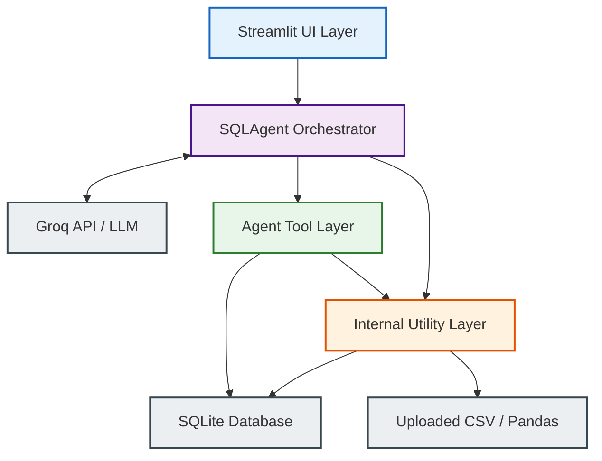
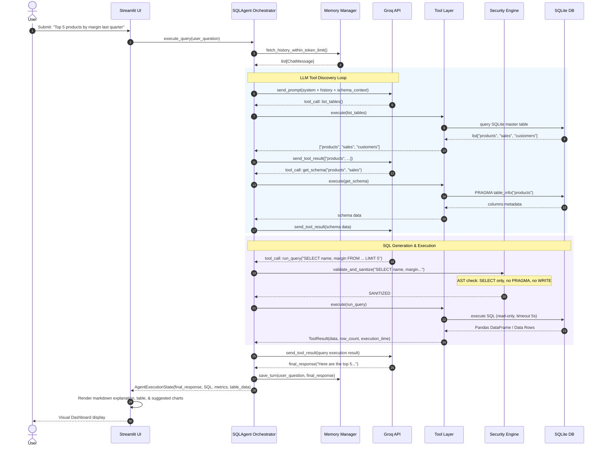
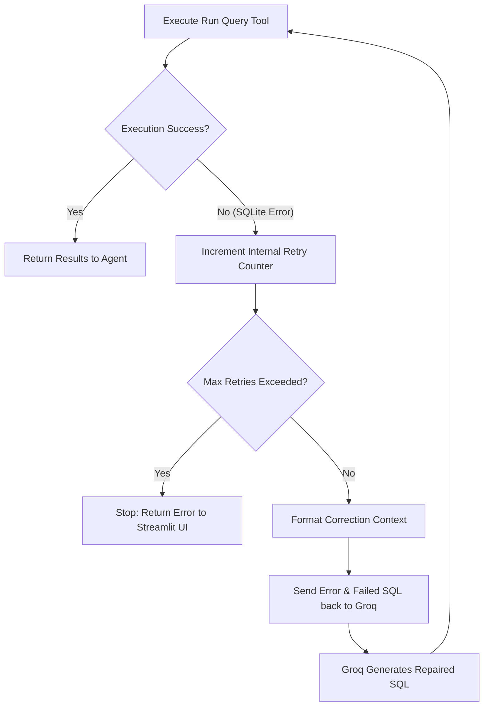
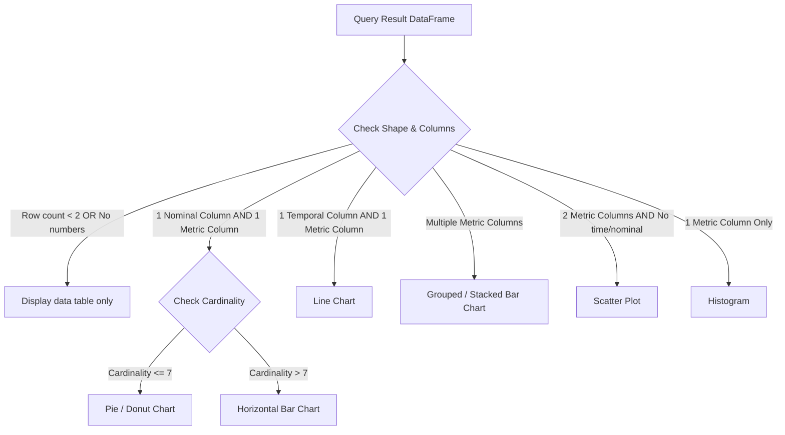
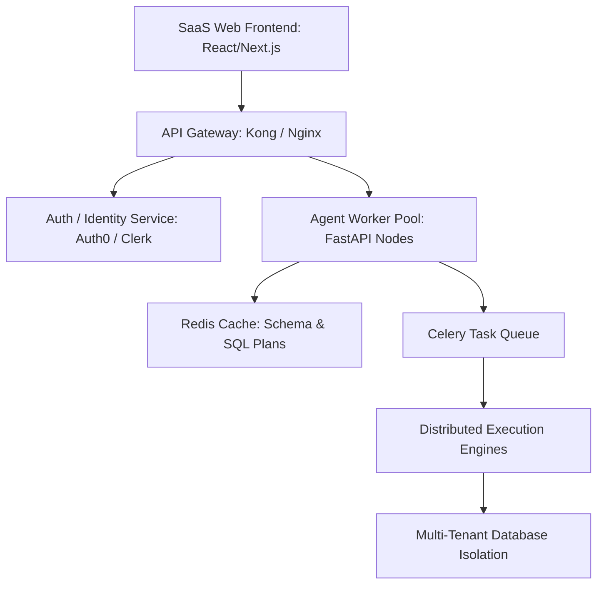

# Software Architecture Design Document: Production-Grade AI Text-to-SQL Agent

This document outlines the complete, production-grade architectural specification for an AI-powered Text-to-SQL Agent. It is designed to run on Streamlit, leverage the Groq API (large language model engine), connect to SQLite databases, process CSV files via Pandas, and transition seamlessly into a scalable enterprise SaaS solution.

---

## 1. System Architecture & Design Philosophy

The agent is designed using **Clean Architecture** principles to guarantee proper separation of concerns, high cohesion, and low coupling. By structuring the system into distinct concentric layers, the core business rules (SQL Agent Orchestration and Tool definitions) remain agnostic to delivery mechanisms (Streamlit UI) or specific external databases.



### Architectural Layers

| Layer | Responsibility | Allowed Dependencies |
| :--- | :--- | :--- |
| **Delivery / Presentation Layer** | UI layout, user input gathering, state management, displaying query results, rendering charts. | Agent Orchestrator, Configuration, Visualizer |
| **Agent Orchestration Layer** | Context window orchestration, stateful dialog flow, Groq API schema conversions, tool invoking loop, self-correction/retry loops. | Agent Tool Layer, Prompt Library, Central Config, Memory, Telemetry |
| **Agent Tool Layer** | Domain-specific actions exposed to the LLM via JSON-Schema declarations. These perform safe reads, analysis, and validation. | Utilities, Databases, Security (AST Sanitizers) |
| **Internal Utility Layer** | File type detection, schema caching, safe DB connection pool instantiation, execution telemetry (timing, token tracking). | Security, Central Config |
| **Enterprise / Data Layer** | Raw database connections, SQLite engines, CSV processing, file storage. | None |

---

## 2. Project Directory Structure

```
natural-language-sql/
│
├── .env.example                 # Environment variable templates (API keys, ports)
├── README.md                    # Project README and developer instructions
├── requirements.txt            # Python production dependencies
├── config.py                   # Centralized Configuration Module
├── main.py                     # Streamlit entrypoint script
│
├── agent/
│   ├── __init__.py
│   ├── orchestrator.py         # SQLAgent orchestrator execution loop
│   ├── memory.py               # Conversational short-term and context window memory
│   └── tools/
│       ├── __init__.py         # Dynamic imports & list of available tools
│       ├── base.py             # Tool base classes & decorators
│       ├── schema.py           # list_tables, get_schema, get_sample_rows, find_column_values
│       ├── query.py            # run_query, explain_query
│       ├── security.py         # sanitize_sql, validate_sql
│       └── optimization.py     # suggest_indexes
│
├── core/
│   ├── __init__.py
│   ├── database.py             # Connection pooling, transaction limits, CSV loading
│   ├── exceptions.py           # Centralized exception types
│   ├── security.py             # AST parsing & security checks
│   └── telemetry.py            # Logger config, transaction time, token metrics
│
├── prompts/
│   ├── system_prompt.txt       # Base agent instructions and persona
│   ├── sql_rules.txt           # Dialect enforcement and strict query constraints
│   ├── explanation_prompt.txt  # Rules for translating result tables into text
│   ├── optimization_prompt.txt # Prompting for suggestions based on execution plans
│   ├── summary_prompt.txt      # Prompt for executive highlights and business summaries
│   └── clarification_prompt.txt# Dialogue for ambiguous queries
│
└── utils/
    ├── __init__.py
    ├── parser.py               # Markdown and LLM JSON block parsers
    └── visualizer.py           # Visualization auto-selector and plotter
```

### Module Descriptions

*   **`config.py`**: Holds typed config fields parsed from environment variables or custom files using Pydantic Settings.
*   **`main.py`**: A modular Streamlit interface that binds state keys (file buffers, database pathing, chat histories) and delegates queries to `agent/orchestrator.py`.
*   **`agent/orchestrator.py`**: Manages execution state. Responsible for checking model output for tool invocations, mapping calls to the tool registry, routing outputs, and controlling error-recovery thresholds.
*   **`agent/memory.py`**: Orchestrates sliding window memory. Implements token-based message ejection to prevent system failures due to Groq context limitations.
*   **`agent/tools/`**: Each file defines tools using Pydantic models for argument validation.
*   **`core/database.py`**: Isolates raw engine setups. Converts CSV input to SQLite dynamically inside a temporary context Manager and returns a read-only database handle.
*   **`core/security.py`**: The boundary guard. Analyzes SQL commands prior to SQLite pipeline validation, parsing Abstract Syntax Trees (AST) using `sqlglot` or `sqlparse` to block destructive actions.
*   **`core/telemetry.py`**: Implements JSON-structured log aggregation, performance metrics logging, and model token usage tracking.
*   **`utils/visualizer.py`**: Uses schema heuristics to decide if data is graphable and constructs Altair or Plotly configurations.

---

## 3. Data Flow Architecture

The dynamic workflow from a user entering a query to generating the final visualization is outlined in the diagram below:



---

## 4. Agent Orchestrator (`SQLAgent`)

The `SQLAgent` orchestrator is modeled as an autonomous state machine that interacts with the Groq API. It processes raw user queries, determines the required execution steps, triggers corresponding tools, processes their outputs, corrects errors, and responds to the user.

### Orchestrator Lifecycle

1.  **Initialization**: Bind conversational memory, target database configuration, dynamic tool registration, telemetry instances, and API parameters.
2.  **Context Preparation**: Read system prompts, dynamic memory logs, and basic database metadata (cached tables), feeding them into the conversation context.
3.  **Inference Cycle**: Query Groq's tool-calling models (e.g., `llama-3.1-70b-versatile` or `mixtral-8x7b-32768`).
4.  **Action Evaluation**:
    *   If the model requests **Tool Execution**, call the corresponding tool wrapper safely (catching runtime errors, checking security limits), format the output into a `tool` role message, and loop back to step 3.
    *   If the model returns a **Direct Answer**, end the loop.
5.  **Exception Mitigation**: If a query failure, token limit error, database lock, or timeout occurs, run the query through the **Error Recovery Pipeline** before exiting.
6.  **Response Assembly**: Save the final state to history, calculate final metrics, and return structured UI model data.

### SQLAgent Interface Design

```python
class SQLAgent:
    def __init__(
        self,
        db_path: str,
        model_name: str = "llama-3.1-70b-versatile",
        temperature: float = 0.0,
        max_retries: int = 3,
        execution_timeout: float = 5.0
    ):
        self.db_path = db_path
        self.model_name = model_name
        self.temperature = temperature
        self.max_retries = max_retries
        self.execution_timeout = execution_timeout
        self.memory = ConversationMemoryManager(max_token_limit=6000)
        self.tool_registry = ToolRegistry()
        self.logger = StructuredTelemetryLogger()
        self.register_default_tools()

    def register_default_tools(self) -> None:
        """Loads default agent tools into the registry."""
        self.tool_registry.register(list_tables)
        self.tool_registry.register(get_schema)
        self.tool_registry.register(get_sample_rows)
        self.tool_registry.register(find_column_values)
        self.tool_registry.register(validate_sql)
        self.tool_registry.register(sanitize_sql)
        self.tool_registry.register(run_query)
        self.tool_registry.register(explain_query)
        self.tool_registry.register(suggest_indexes)

    def execute(self, user_query: str) -> AgentResponse:
        """
        Main execution loop for user queries.
        Handles LLM tool-calling and response parsing.
        """
        pass

    def _execute_tool_call(self, tool_name: str, arguments: dict) -> ToolResponse:
        """Executes a single tool run, checking security constraints and timing."""
        pass
```

---

## 5. Agent Tool Layer

Tools are self-describing modules configured with schemas so that the LLM understands when and how to call them. 

### Tool Specifications

```python
# Types mapping for schemas and tool interactions
from typing import TypedDict, List, Dict, Any, Optional

class TableSchema(TypedDict):
    name: str
    columns: List[Dict[str, str]] # [{'name': 'id', 'type': 'INTEGER'}, ...]
    primary_keys: List[str]
    foreign_keys: List[Dict[str, str]] # [{'from': 'cust_id', 'table': 'customers', 'to': 'id'}]
```

#### 1. `list_tables`
*   **Purpose**: Get the names of all tables currently available in the database.
*   **Input Schema**: `{}` (No parameters)
*   **Output JSON Schema**:
    ```json
    {
      "tables": ["list", "of", "table_names"]
    }
    ```
*   **Detailed Logic**: Query SQLite catalog `sqlite_master` matching type `table` (excluding internal SQLite system tables like `sqlite_sequence`).

#### 2. `get_schema`
*   **Purpose**: Retrieve column metadata, data types, primary keys, and foreign keys for target tables to help write syntactically correct queries.
*   **Input Schema**:
    ```json
    {
      "type": "object",
      "properties": {
        "tables": {
          "type": "array",
          "items": { "type": "string" },
          "description": "List of tables to fetch schema context for."
        }
      },
      "required": ["tables"]
    }
    ```
*   **Output JSON Schema**: Maps table names to detailed schema structures:
    ```json
    {
      "tables": {
        "table_name_here": {
          "columns": [{"name": "id", "type": "INTEGER"}],
          "primary_keys": ["id"],
          "foreign_keys": [{"column": "group_id", "references_table": "groups", "references_column": "id"}]
        }
      }
    }
    ```
*   **Detailed Logic**: Iterate through the requested tables, run `PRAGMA table_info(table_name)` and `PRAGMA foreign_key_list(table_name)`, and format the outputs.

#### 3. `get_sample_rows`
*   **Purpose**: Fetch sample data rows from specified tables to understand column value patterns before generating filters.
*   **Input Schema**:
    ```json
    {
      "type": "object",
      "properties": {
        "table": { "type": "string" },
        "limit": { "type": "integer", "default": 3, "maximum": 10 }
      },
      "required": ["table"]
    }
    ```
*   **Output JSON Schema**:
    ```json
    {
      "table": "table_name",
      "columns": ["col1", "col2"],
      "rows": [["val1", "val2"]]
    }
    ```
*   **Detailed Logic**: Safely execute a parameterized query: `SELECT * FROM {table} LIMIT {limit}`. Tables are validated against the master list to prevent SQL injection.

#### 4. `find_column_values`
*   **Purpose**: Search a specific column for distinct matching entries. This helps the LLM find exact string literals (e.g. `'APAC'` vs `'Asia Pacific'`) and avoid invalid filter criteria.
*   **Input Schema**:
    ```json
    {
      "type": "object",
      "properties": {
        "table": { "type": "string" },
        "column": { "type": "string" },
        "search_term": { "type": "string", "description": "Optional substring to filter by." },
        "limit": { "type": "integer", "default": 10 }
      },
      "required": ["table", "column"]
    }
    ```
*   **Output JSON Schema**:
    ```json
    {
      "table": "table_name",
      "column": "column_name",
      "distinct_values": ["value1", "value2"]
    }
    ```
*   **Detailed Logic**: Construct a `SELECT DISTINCT {column} FROM {table} WHERE {column} LIKE ? LIMIT {limit}` query, sanitizing column and table inputs against known schema names.

#### 5. `validate_sql`
*   **Purpose**: Verify syntax, table references, and column references in generated SQL queries without running them.
*   **Input Schema**:
    ```json
    {
      "type": "object",
      "properties": {
        "sql": { "type": "string", "description": "The raw SQL statement to analyze." }
      },
      "required": ["sql"]
    }
    ```
*   **Output JSON Schema**:
    ```json
    {
      "is_valid": true,
      "error": null,
      "ast_summary": { "tables_referenced": ["sales"], "operation": "SELECT" }
    }
    ```
*   **Detailed Logic**: Parse the query with `sqlglot`. If parsed successfully, check table and column references against the cached schema. Return descriptive error coordinates if validation fails.

#### 6. `sanitize_sql`
*   **Purpose**: Scan SQL strings to block execution of dangerous or destructive operations.
*   **Input Schema**:
    ```json
    {
      "type": "object",
      "properties": {
        "sql": { "type": "string" }
      },
      "required": ["sql"]
    }
    ```
*   **Output JSON Schema**:
    ```json
    {
      "is_safe": true,
      "blocked_tokens_found": [],
      "sanitized_sql": "SELECT ... "
    }
    ```
*   **Detailed Logic**: Extract SQL nodes using AST compilation. Allow **only** `SELECT`, `WITH`, and `EXPLAIN` statements. Reject `INSERT`, `UPDATE`, `DELETE`, `DROP`, `ALTER`, `CREATE`, `ATTACH`, `PRAGMA`, and file system functions.

#### 7. `run_query`
*   **Purpose**: Safely execute a sanitized SQL statement against the SQLite database and return formatted results.
*   **Input Schema**:
    ```json
    {
      "type": "object",
      "properties": {
        "sql": { "type": "string" }
      },
      "required": ["sql"]
    }
    ```
*   **Output JSON Schema**:
    ```json
    {
      "columns": ["id", "amount"],
      "rows": [[1, 500.00]],
      "row_count": 1,
      "execution_time_ms": 12.4
    }
    ```
*   **Detailed Logic**: Run the query through the AST security scanner, execute it on a read-only database connection, enforce query timeouts, limit returned rows to configuration maximums, and record execution metrics.

#### 8. `explain_query`
*   **Purpose**: Run SQLite's `EXPLAIN QUERY PLAN` on the generated SQL to analyze execution paths.
*   **Input Schema**:
    ```json
    {
      "type": "object",
      "properties": {
        "sql": { "type": "string" }
      },
      "required": ["sql"]
    }
    ```
*   **Output JSON Schema**:
    ```json
    {
      "query_plan_steps": [
        { "selectid": 0, "order": 0, "from": 0, "detail": "SCAN TABLE sales" }
      ]
    }
    ```
*   **Detailed Logic**: Prepend `EXPLAIN QUERY PLAN` to the SQL query, execute it safely, and format the output into structured steps.

#### 9. `suggest_indexes`
*   **Purpose**: Suggest missing indexes by analyzing execution plans (e.g. checking for full table scans on heavily filtered tables).
*   **Input Schema**:
    ```json
    {
      "type": "object",
      "properties": {
        "sql": { "type": "string" }
      },
      "required": ["sql"]
    }
    ```
*   **Output JSON Schema**:
    ```json
    {
      "suggested_indexes": [
        {
          "table": "sales",
          "columns": ["transaction_date"],
          "ddl": "CREATE INDEX idx_sales_transaction_date ON sales(transaction_date);",
          "benefit_reason": "Removes SCAN TABLE in favor of binary search on large date queries."
        }
      ]
    }
    ```
*   **Detailed Logic**: Extract filter conditions (`WHERE` clauses) and join keys (`JOIN` conditions) using AST analysis. Suggest indexes for columns that trigger full table scans.

---

## 6. Internal Utility Layer

Utilities provide helper operations for the system. They are not exposed to the LLM to prevent tool-calling overhead.

| Utility Function | Reason for Existence | API Signature Specification |
| :--- | :--- | :--- |
| **`connect_database`** | Returns a secure database connection. Handles read-only constraints, URI structures, and thread pooling. | `def connect_database(db_path: str, read_only: bool = True) -> sqlite3.Connection` |
| **`load_csv`** | Converts uploaded CSV files into SQLite database tables using Pandas. Automatically infers schemas and cleans column headers (e.g., removing spaces and special characters). | `def load_csv(csv_path: str, conn: sqlite3.Connection, table_name: str) -> None` |
| **`detect_file_type`** | Validates uploaded files by reading their magic bytes (headers) instead of relying solely on the file extension. Blocks spoofing attempts. | `def detect_file_type(file_bytes: bytes) -> str` (Returns `'csv'`, `'sqlite'`, or raises `ValidationError`) |
| **`cache_schema`** | Caches schema data in memory (using a Time-To-Live policy) to prevent repeated metadata queries to the database. | `def cache_schema(db_path: str) -> Dict[str, TableSchema]` |
| **`format_results`** | Formats database query results for the LLM context. Replaces empty columns with null markers and trims long strings to save tokens. | `def format_results(df: pd.DataFrame, limit: int) -> str` |
| **`log_agent_steps`** | Records step-by-step agent actions (such as thought processes and intermediate tool outputs) for debugging and system auditing. | `def log_agent_steps(run_id: str, step_type: str, details: Dict[str, Any]) -> None` |
| **`retry_llm_call`** | Wraps Groq API requests in a retry loop using exponential backoff to handle rate limits (`HTTP 429`) or temporary service downtime. | `def retry_llm_call(func: Callable, *args, **kwargs) -> Any` |
| **`parse_llm_response`** | Extracts structured content (such as SQL blocks or markdown JSON) from raw LLM responses. | `def parse_llm_response(raw_text: str) -> Tuple[str, str]` (Returns `(thought_segment, code_block_segment)`) |
| **`measure_execution_time`** | A decorator that measures execution times for query runs, API calls, and tool executions to track system performance. | `def measure_execution_time(func: Callable) -> Callable` |

---

## 7. Prompt Library

Prompts are stored as distinct text templates to separate prompt engineering logic from Python code.

### Prompt Matrix

```
prompts/
├── system_prompt.txt
├── sql_rules.txt
├── explanation_prompt.txt
├── optimization_prompt.txt
├── summary_prompt.txt
└── clarification_prompt.txt
```

#### 1. `system_prompt.txt`
*   **Purpose**: Defines the agent's identity, behavior, and rules for choosing tools.
*   **Core Instructions**:
    *   Act as an expert data analyst.
    *   Do not guess database structures; use schema tools to fetch actual metadata.
    *   Verify column structures before generating SQL.
    *   Refuse requests to run destructive queries (such as updates or deletes) using natural language.
    *   Maintain a strict step-by-step thinking process.

#### 2. `sql_rules.txt`
*   **Purpose**: Enforces syntax rules for SQLite query generation.
*   **Core Instructions**:
    *   Generate standard SQL compliant with SQLite 3.x.
    *   Enclose column names containing spaces or special characters in double quotes.
    *   Always cast aggregates to double decimals for financial figures.
    *   Handle potential null values with functions like `COALESCE`.
    *   Include a `LIMIT` clause on all queries unless explicitly requested otherwise.

#### 3. `explanation_prompt.txt`
*   **Purpose**: Formats query results back into natural language explanations.
*   **Core Instructions**:
    *   Explain the query results clearly and concisely without using technical jargon.
    *   Ensure the explanation directly answers the user's question using the returned data.
    *   Do not reference internal database columns, primary keys, or IDs unless relevant to the user.

#### 4. `optimization_prompt.txt`
*   **Purpose**: Helps the agent review execution plans and recommend database optimizations.
*   **Core Instructions**:
    *   Analyze the output of `EXPLAIN QUERY PLAN`.
    *   Identify potential performance bottlenecks (such as full table scans).
    *   Generate `CREATE INDEX` recommendations only for columns that will improve query speeds.
    *   Explain the performance benefit of suggested indexes in plain English.

#### 5. `summary_prompt.txt`
*   **Purpose**: Generates high-level business summaries of query results.
*   **Core Instructions**:
    *   Summarize key trends, anomalies, or insights from the dataset.
    *   Present key statistics (such as averages or totals) in bullet points.
    *   Avoid simply listing the raw data rows; instead, write summaries that highlight important takeaways.

#### 6. `clarification_prompt.txt`
*   **Purpose**: Handles vague, ambiguous, or incomplete user requests.
*   **Core Instructions**:
    *   Identify ambiguous terms or column references in the user's query.
    *   List possible options based on the actual schema (e.g. "Did you mean sales volume or net revenue?").
    *   Ask clarifying questions politely to help the user refine their request.

---

## 8. Memory Architecture

The memory layer uses a **sliding window context manager** to store session histories. This ensures the conversational context remains within Groq's token limits during multi-turn interactions.

```mermaid
graph LR
    subgraph Conversation History Log
        H1[User: Show total sales]
        H2[Agent: SQL + Table Results]
        H3[User: Only for 2025]
        H4[Agent: SQL + Restructured Table]
    end

    subgraph Memory Manager (Sliding Window)
        direction TB
        TokenCounter{Sum Tokens}
        TokenCounter -- Under Max Limit (e.g., 6000) --> LoadAll[Keep Complete Context]
        TokenCounter -- Over Max Limit --> Prune[Eject Oldest Messages but Keep System & Database Schemas]
    end

    H1 & H2 & H3 & H4 --> TokenCounter
```

### Context Construction Strategy

When submitting a request to the LLM, the Memory Manager constructs the context window systematically:

```
[SYSTEM PROMPT]
  └── Base agent instructions & rules
[SQL RULES]
  └── Syntax and dialect constraints
[DYNAMIC SCHEMA METADATA]
  └── Current database schema definition (refreshed per user action)
[PRUNED CONVERSATION HISTORY]
  ├── User: "Show sales."
  ├── Agent: "SQL Generated: SELECT sum(total) FROM sales..."
  ├── User: "Now only for 2025." (Refers back to the previous sales query)
  └── [New User Query Buffer]
```

### Token Window Management

*   **Tokenizer Binding**: Use `tiktoken` (cl100k_base schema) to calculate token lengths for all messages.
*   **Ejection Strategy**: If total tokens exceed `max_token_limit`, delete messages starting from the oldest history entries. **Do not delete system prompts or schema definitions.**
*   **Thread Safety**: Enforce isolation between Streamlit sessions using unique identifiers stored in `st.session_state` to prevent data leaks between concurrent users.

---

## 9. Error Recovery Pipeline

If a SQL query execution fails, the agent attempts to automatically self-correct the code using a feedback loop.



### Self-Correction Prompt Template

When a query fails, the orchestrator formats and submits the error to the LLM:

```
The SQL query you generated failed execution. Please analyze the error message and correct the query.

### DATABASE SCHEMA
{schema_context}

### FAILED QUERY
```sql
{failed_sql}
```

### ERROR MESSAGE FROM SQLITE
{error_message}

### RESOLUTION STEPS
1. Analyze if the error is due to:
   - Misspelled column or table names.
   - Incorrect JOIN conditions.
   - Missing tables.
   - SQLite syntax limitations.
2. Rewrite the query to fix the error.
3. Output ONLY the corrected SQL query inside a markdown code block.
```

---

## 10. Production-Level Security Architecture

To prevent unauthorized access, data loss, and SQL injection, the system runs with a multi-layered security model.

```
       USER REQUEST
            │
            ▼
┌───────────────────────┐
│ Streamlit File Guard  │ ── Block files > 50MB, check magic bytes
└───────────────────────┘
            │
            ▼
┌───────────────────────┐
│  AST Security Parser  │ ── Verify query contains SELECT only (sqlglot)
└───────────────────────┘
            │
            ▼
┌───────────────────────┐
│ Read-Only Connection  │ ── Enforce read-only sqlite database engine
└───────────────────────┘
            │
            ▼
┌───────────────────────┐
│ Execution Sandbox     │ ── Enforce execution timeout limits (5s max)
└───────────────────────┘
            │
            ▼
       SQL ENGINE
```

### Security Safeguards

*   **Read-Only DB Connections**: Open connections using Python's SQLite URI query parameters:
    ```python
    conn = sqlite3.connect("file:sandbox.db?mode=ro", uri=True)
    ```
    This ensures that even if a write command passes other security filters, the database engine itself rejects it.
*   **AST-Based Query Verification**: Parse SQL queries using `sqlglot` to verify execution safety. Reject queries containing any operations other than `SELECT` or `WITH`.
    ```python
    # Logic checklist for validation:
    # 1. Parse query: expressions = sqlglot.parse(sql_string)
    # 2. Iterate nodes: If node type matches Update, Delete, Insert, Drop, or Alter, raise SecurityException.
    ```
*   **Execution Timeouts**: Run queries in secondary threads using system timers or `sqlite3.set_progress_handler` to terminate connections if a query takes longer than `5.0` seconds. This prevents Denial of Service (DoS) attacks caused by CPU-intensive queries (such as infinite joins).
*   **File Upload Validation**:
    *   Restrict uploads to a maximum size of **50MB**.
    *   Verify file types by scanning file headers (magic bytes) to ensure uploaded files are valid CSVs or SQLite databases.
    *   Convert CSV files to SQLite databases inside temporary sandboxes, stripping special characters from column headers to prevent SQL injection during import.
*   **Resource Cleanup**: Use Python `contextlib.exitstack` hooks to delete temporary files and close active database connections when a user session ends.

---

## 11. Structured Logging & Telemetry

The application outputs structured JSON logs to standard output. This makes it easy for container orchestrators (like Docker or Kubernetes) and log collectors (like Datadog or ELK) to parse and index system telemetry.

### Telemetry JSON Schema

```json
{
  "$schema": "https://json-schema.org/draft/2020-12/schema",
  "title": "AgentTransactionTelemetryLog",
  "type": "object",
  "properties": {
    "timestamp": { "type": "string", "format": "date-time" },
    "session_id": { "type": "string", "format": "uuid" },
    "user_query": { "type": "string" },
    "execution_status": { "type": "string", "enum": ["SUCCESS", "FAILED", "BLOCKED_BY_SECURITY"] },
    "metrics": {
      "type": "object",
      "properties": {
        "execution_time_ms": { "type": "number" },
        "token_usage_groq": {
          "type": "object",
          "properties": {
            "prompt_tokens": { "type": "integer" },
            "completion_tokens": { "type": "integer" },
            "total_tokens": { "type": "integer" }
          }
        },
        "query_cost_usd": { "type": "number" }
      }
    },
    "agent_trace": {
      "type": "array",
      "items": {
        "type": "object",
        "properties": {
          "step": { "type": "integer" },
          "tool_called": { "type": "string" },
          "arguments": { "type": "string" },
          "duration_ms": { "type": "number" },
          "status": { "type": "string" }
        }
      }
    },
    "generated_sql": { "type": "string" },
    "rows_returned": { "type": "integer" },
    "retry_attempts": { "type": "integer" },
    "error_details": {
      "type": "object",
      "properties": {
        "phase": { "type": "string" },
        "message": { "type": "string" },
        "stack_trace": { "type": "string" }
      }
    }
  },
  "required": ["timestamp", "session_id", "user_query", "execution_status", "metrics"]
}
```

### Log Storage Strategy

*   **Standard Out (stdout)**: Write JSON logs directly to standard out to align with modern cloud-native standards.
*   **File Rotation**: Write logs to a local file system directory (e.g. `./logs/agent.log`) with automatic rotation policies:
    *   Rotate files when they reach **10MB**.
    *   Keep up to **5** backup files.
    *   Compress old log files using `gzip`.

---

## 12. Centralized Configuration Management (`config.py`)

All application settings are defined in a single, validated configuration file using Pydantic Settings.

```python
from pydantic_settings import BaseSettings
from pydantic import Field, SecretStr

class Settings(BaseSettings):
    # LLM Settings
    GROQ_API_KEY: SecretStr = Field(..., env="GROQ_API_KEY")
    LLM_MODEL: str = Field("llama-3.1-70b-versatile", env="LLM_MODEL")
    TEMPERATURE: float = Field(0.0, env="LLM_TEMPERATURE")
    MAX_RETRIES: int = Field(3, env="AGENT_MAX_RETRIES")

    # Database Settings
    SQL_TIMEOUT_SEC: float = Field(5.0, env="SQL_TIMEOUT_SEC")
    MAX_QUERY_ROWS: int = Field(1000, env="MAX_QUERY_ROWS")
    SCHEMA_CACHE_TTL_SEC: int = Field(300, env="SCHEMA_CACHE_TTL_SEC")

    # Security & Limits
    MAX_UPLOAD_SIZE_MB: int = Field(50, env="MAX_UPLOAD_SIZE_MB")
    SAMPLE_ROWS_LIMIT: int = Field(3, env="SAMPLE_ROWS_LIMIT")
    
    # UI Configuration
    CHART_DEFAULT_THRESHOLD: int = Field(50, env="CHART_DEFAULT_THRESHOLD")
    
    # Logging Configuration
    LOG_LEVEL: str = Field("INFO", env="LOG_LEVEL")
    LOG_FILE_PATH: str = Field("logs/agent.log", env="LOG_FILE_PATH")

    class Config:
        env_file = ".env"
        env_file_encoding = "utf-8"

# Instantiate for import across system
settings = Settings()
```

### Configuration Options Checklist

| Setting | Type | Purpose |
| :--- | :--- | :--- |
| **`GROQ_API_KEY`** | SecretStr | Secures API keys and prevents them from leakages during printing or logging. |
| **`LLM_MODEL`** | String | Configures the target Groq model (e.g. Llama-3 or Mixtral variants). |
| **`TEMPERATURE`** | Float | Configures LLM temperature; set to `0.0` for deterministic SQL output. |
| **`MAX_RETRIES`** | Integer | Configures maximum retry attempts for API calls and query corrections. |
| **`SQL_TIMEOUT_SEC`** | Float | Sets maximum execution times for database queries to prevent slow-running transactions. |
| **`MAX_QUERY_ROWS`** | Integer | Limits data payloads to prevent Out-Of-Memory (OOM) errors in Streamlit. |
| **`SCHEMA_CACHE_TTL_SEC`**| Integer | Configures TTL limits for cached schemas, reducing database read overhead. |
| **`MAX_UPLOAD_SIZE_MB`** | Integer | Restricts file upload sizes to protect memory resources. |
| **`SAMPLE_ROWS_LIMIT`** | Integer | Configures sample row limits for table profiling. |
| **`CHART_DEFAULT_THRESHOLD`**| Integer | Sets threshold limits for generating visualizations (e.g., skips charts if data is too small). |
| **`LOG_LEVEL`** | String | Sets log levels (`DEBUG`, `INFO`, `WARNING`, `ERROR`). |

---

## 13. Streamlit UI Layout & UX Design

The user interface is designed to display inputs, agent workflows, query results, and charts clearly in a single dashboard.

```
┌────────────────────────────────────────────────────────────────────────┐
│                                                                        │
│  [Sidebar]                  [Main Workspace Header]                     │
│ ┌────────────────────────┐ ┌─────────────────────────────────────────┐ │
│ │                        │ │   📊 Text-to-SQL Analytics Copilot      │ │
│ │ 📁 File Uploader       │ ├─────────────────────────────────────────┤ │
│ │  (Drag & Drop CSV/.db) │ │                                         │ │
│ │                        │ │  [Agent State Indicator: "Analyzing"]   │ │
│ │ 🗄️ Database Info        │ │  ┌───────────────────────────────────┐  │ │
│ │  • active_tables: 4    │ │  │ User: Top 5 products by margin?│  │ │
│ │                        │ │  └───────────────────────────────────┘  │ │
│ │ 🗺️ Schema Explorer     │ │  ┌───────────────────────────────────┐  │ │
│ │  [▶ Select Table]      │ │  │ agent log: list_tables() -> OK    │  │ │
│ │                        │ │  │ agent log: validate_sql() -> OK   │  │ │
│ │ ⚙️ Control Settings    │ │  └───────────────────────────────────┘  │ │
│ │  • Timeout Limit: 5s   │ │                                         │ │
│ │  • Row Limits: 100     │ │  [💻 Generated SQL Code Area]           │ │
│ │                        │ │  ```sql                                 │ │
│ │ 📜 Query History       │ │  SELECT name, margin FROM products...   │ │
│ │  • "Top 5 products..." │ │  ```                                    │ │
│ │  • "Sales by month"    │ │                                         │ │
│ │                        │ │  [📊 Rendered Chart Panel]              │ │
│ │                        │ │  (Recommended: Horizontal Bar Chart)    │ │
│ │                        │ │                                         │ │
│ │                        │ │  [📋 Raw Results Grid (Dataframe)]      │ │
│ │                        │ │                                         │ │
│ │                        │ │  [💡 Executive Insight Summary]         │ │
│ │                        │ │  "Product A contributed 42%..."         │ │
│ │                        │ │                                         │ │
│ └────────────────────────┘ └─────────────────────────────────────────┘ │
└────────────────────────────────────────────────────────────────────────┘
```

### UI Layout Components

#### Sidebar Panel
*   **File Uploader Widget**: Supports drag-and-drop file uploads for SQLite databases (`.db`) and CSV files.
*   **Active Schema Explorer**: A tree-view component that lets users explore tables, columns, and data types in the active database.
*   **History Logs**: Displays list items showing previous queries. Clicking a log reloads the query's history state.
*   **System Settings**: Toggle switches to configure execution limits, query timeouts, and log visibility.

#### Main Work Area
*   **Dialogue Interface**: Structured chat elements for users to submit natural language questions.
*   **Progress Indicators**: Expandable logs showing the agent's step-by-step tool executions.
*   **Code Presenter**: Highlights generated SQL syntax with one-click copy options.
*   **Visualizations Panel**: Renders interactive charts generated based on result datasets.
*   **Data Grid**: Interactive, paginated data tables with CSV download options.
*   **Business Intelligence Dashboard**: Displays explanations and highlights in markdown boxes.

---

## 14. Natural Language Summarization & Visualizations

### Business Intelligence Summarization

Raw query results are summarized using a secondary prompt optimized for business analysis. Instead of simply repeating data points, the agent summarizes trends, outliers, and key takeaways.

*   **Decision Metrics Matrix**:
    *   **Data Dimensions**:
        *   If the result is a single value, present it directly.
        *   If the dataset is small (fewer than 5 rows), write a comparative summary.
        *   If the dataset is large, calculate and present trend percentages and metrics.
    *   **Heuristics Evaluation**: Identify the main column types. If numeric fields (such as revenue or transaction counts) are paired with text dimensions (such as category or date), calculate percentage distributions, rank items, and call out the top contributors.

### Dynamic Visualization Recommendation Engine

The system uses rules to recommend and render appropriate chart configurations based on the data types and column structures in query results.



### Visualization Guidelines

| Data Layout | Suggested Chart | User Experience / Value |
| :--- | :--- | :--- |
| **Categorical + Numeric Value (Cardinality <= 7)** | **Donut Chart** | Displays percentage contributions clearly. |
| **Categorical + Numeric Value (Cardinality > 7)** | **Horizontal Bar Chart**| Displays long category names clearly without cluttering the axis labels. |
| **Time Period + Numeric Value** | **Line Chart** | Displays trends and data changes over time. |
| **Numeric Value vs Numeric Value** | **Scatter Plot** | Displays correlations and distributions. |
| **Single Column of Metrics** | **Histogram** | Displays data distribution density. |

---

## 15. Scalability & Database Portability

The system uses the **Provider / Adapter Pattern** to ensure it can support databases other than SQLite without requiring changes to the core application or UI.

```
       ┌────────────────────────┐
       │   SQLAgent Engine      │
       └────────────────────────┘
                    │
                    ▼
       ┌────────────────────────┐
       │   IDatabaseProvider    │  ◄── Abstract Interface
       └────────────────────────┘
                    │
         ┌──────────┼──────────┐
         ▼          ▼          ▼
     ┌───────┐  ┌───────┐  ┌───────┐
     │SQLite │  │Postgre│  │DuckDB │  ◄── Database-Specific Implementation
     │Adapter│  │Adapter│  │Adapter│
     └───────┘  └───────┘  └───────┘
```

### Interface Specifications

```python
from abc import ABC, abstractmethod

class IDatabaseProvider(ABC):
    @abstractmethod
    def connect(self) -> None:
        """Establishes database connection pools."""
        pass

    @abstractmethod
    def execute_query(self, sql: str, timeout: float) -> pd.DataFrame:
        """Executes queries safely and returns Pandas DataFrames."""
        pass

    @abstractmethod
    def get_tables(self) -> List[str]:
        """Queries the system schema to return all table names."""
        pass

    @abstractmethod
    def get_table_schema(self, table_name: str) -> TableSchema:
        """Queries the system catalog to return column and key metadata."""
        pass

    @abstractmethod
    def get_query_plan(self, sql: str) -> str:
        """Returns the EXPLAIN execution plan for the query."""
        pass
```

### Database Target Extensions

*   **DuckDB**:
    *   *Implementation*: Replace sqlite3 connections with DuckDB engines.
    *   *Value*: Provides fast query speeds for large CSV datasets and complex analytical queries.
*   **PostgreSQL**:
    *   *Implementation*: Create a database client using `psycopg2` or `asyncpg` connection pools.
    *   *Value*: Supports production database features like schema configurations and user access controls.
*   **Snowflake / BigQuery**:
    *   *Implementation*: Connect using official Python client SDKs. Read table metadata from `INFORMATION_SCHEMA` catalogs.
    *   *Value*: Scales queries to handle enterprise-level cloud data warehouses.

---

## 16. SaaS Extension Plan

The architecture is designed to scale from a single-user Streamlit application to a multi-tenant SaaS platform.



### SaaS Transition Strategy

1.  **Distributed Task Processing**: Move heavy query operations from the web server thread to a background task queue (like Celery or RQ) to prevent browser timeouts on long-running queries.
2.  **Schema Caching**: Store database schema structures and execution plans in Redis to improve performance and reduce database query volumes.
3.  **Tenant Isolation**: Group database connections dynamically based on tenant IDs. Limit database users to read-only roles scoped to their specific datasets.
4.  **Usage Quotas**: Track and limit API usage and query runtime parameters by tenant or API key to prevent resource abuse.

---

## 17. Interview Readiness & Engineering Philosophy

This architecture is built using established, industry-standard design patterns:

*   **Facade Pattern**: The `SQLAgent` acts as a single interface to hide complex interactions between memory, prompt libraries, and validation checkers from the Streamlit UI.
*   **Adapter Pattern**: The `IDatabaseProvider` interface decouples the core agent from specific SQL engines. This makes it easy to switch databases or add new query engines (like PostgreSQL or DuckDB).
*   **Strategy Pattern**: Visualizations are generated using a strategy-based recommendation engine. It selects the best rendering parameters automatically by analyzing column structures in query results.
*   **Command Pattern**: Agent tools are modeled as self-describing commands. This decouples tool validation logic from the main orchestrator execution loop.

### Core Architecture Strengths

*   **Robust Security**: Employs multiple layers of security, including AST analysis, execution timeouts, and read-only database connections, to ensure safe query runtimes.
*   **Self-Correction Logic**: Features automatic self-correction pipelines that capture query errors and send them back to the LLM for correction. This improves query success rates without requiring user intervention.
*   **Context Window Optimization**: Uses token-based sliding window memory managers to optimize token usage and prevent system crashes caused by context window limitations.
