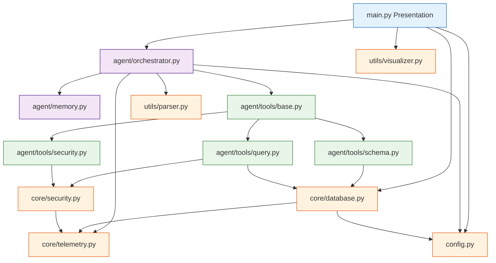
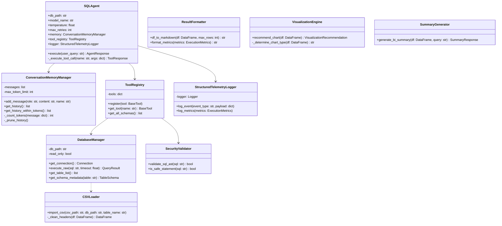
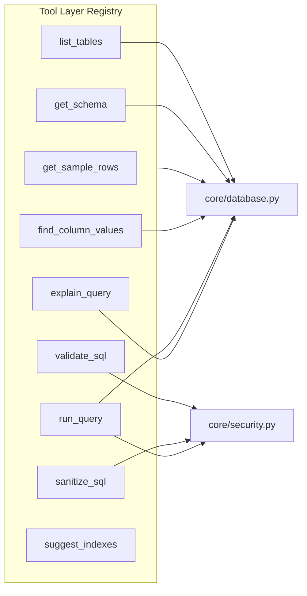
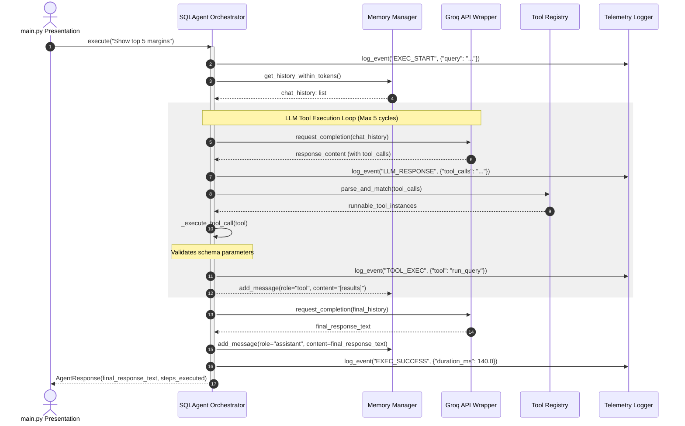
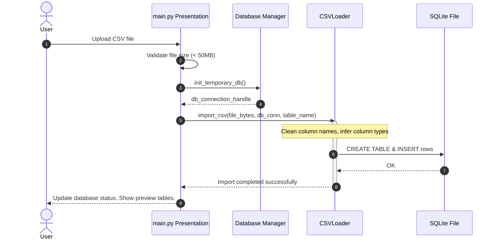
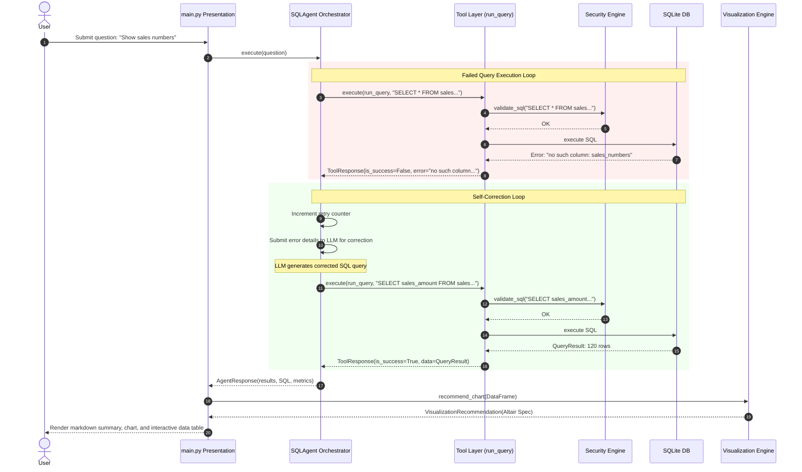

# Low-Level Design (LLD) Document: AI Text-to-SQL Agent

This document serves as the implementation blueprint for the Production-Grade AI Text-to-SQL Agent system. It translates the approved High-Level Architecture (HLD) into class contracts, data schemas, API specifications, and flow sequences.

---

## SECTION 1: Project Dependency Graph

The project enforces clean architecture layers. Outer layers (UI) depend on inner layers (Orchestration, Models, Core Utilities), and dependency direction strictly flows inwards. Inner core modules have no knowledge of Streamlit.

### Module Dependency Diagram



### Dependency Rules Table

| Module | Permitted Imports | Strictly Prohibited Imports |
| :--- | :--- | :--- |
| **`main.py` (Streamlit)** | `agent.orchestrator`, `core.database`, `utils.visualizer`, `config` | Any raw tool function directly, raw SQL execution nodes, inner telemetry logs. |
| **`agent/orchestrator.py`**| `agent.memory`, `agent.tools.base`, `core.telemetry`, `config`, `utils.parser` | `streamlit`, raw SQLite file pointers, HTML frameworks. |
| **`agent/tools/*`** | `core.database`, `core.security`, `core.telemetry`, `config` | `agent.orchestrator`, `agent.memory`, `streamlit`. |
| **`core/database.py`** | `config`, `core.telemetry`, `core.exceptions` | `agent/*`, `streamlit`, `utils.visualizer`. |
| **`core/security.py`** | `config`, `core.telemetry`, `core.exceptions` | `sqlite3`, `pandas`, `agent/*`. |

---

## SECTION 2: Detailed Folder Design

### 1. Root Directory (`/`)
*   **Purpose**: Bootstrapping, dependency layout, global configuration, and workspace orchestration.
*   **Files**:
    *   `main.py`: Streamlit entrypoint containing layout setups and session lifecycle event triggers.
    *   `config.py`: Pydantic settings loading and mapping structure for environments.
    *   `requirements.txt`: Python package declaration.
    *   `.env.example`: Safe environmental key indicators.
*   **Dependencies**: `agent/`, `core/`, `utils/`, `streamlit`, `pydantic`.
*   **Public Interfaces**: `settings` (global configuration instance), `main()` execution entrypoint.
*   **Private Helpers**: Streamlit sub-rendering functions for UI panels.

### 2. Agent Core Module (`/agent`)
*   **Purpose**: Manages execution state, token optimization, memory boundaries, and tool orchestration.
*   **Files**:
    *   `orchestrator.py`: Implements the `SQLAgent` orchestrator execution loop.
    *   `memory.py`: Implements the sliding window memory manager.
*   **Dependencies**: `core/`, `prompts/`, `utils/`, `groq`, `tiktoken`.
*   **Public Interfaces**: `SQLAgent.execute(user_query: str) -> AgentResponse`, `ConversationMemoryManager`.
*   **Private Helpers**: `SQLAgent._execute_tool_call()`, `ConversationMemoryManager._prune_history()`.

### 3. Agent Tools Sub-module (`/agent/tools`)
*   **Purpose**: Exposes database operations and analysis tools to the LLM.
*   **Files**:
    *   `base.py`: Declares `BaseTool` models and registries.
    *   `schema.py`: Implements schemas, table lookups, and value indexing tools.
    *   `query.py`: Implements execution and validation tools.
    *   `security.py`: Implements sanitization wrappers.
    *   `optimization.py`: Implements query optimization tools.
*   **Dependencies**: `core/database.py`, `core/security.py`, `pydantic`.
*   **Public Interfaces**: `ToolRegistry`, tool declarations (`run_query`, `get_schema`, etc.).
*   **Private Helpers**: Dynamic argument validation and casting helpers.

### 4. Core System Module (`/core`)
*   **Purpose**: Coordinates core infrastructure services like database engines, security analysis, exceptions, and logging.
*   **Files**:
    *   `database.py`: Establishes read-only connection pooling and handles CSV-to-SQLite conversion workflows.
    *   `security.py`: Implements Abstract Syntax Tree (AST) validation logic to block unauthorized SQL queries.
    *   `telemetry.py`: Implements JSON-structured telemetry logging.
    *   `exceptions.py`: Declares custom exception classes.
*   **Dependencies**: `sqlite3`, `pandas`, `sqlglot`, `logging`.
*   **Public Interfaces**: `DatabaseManager`, `SecurityValidator`, `StructuredTelemetryLogger`.
*   **Private Helpers**: Internal database connection decorators.

### 5. Utility Module (`/utils`)
*   **Purpose**: Utility operations for text parsing and visual charting configurations.
*   **Files**:
    *   `parser.py`: Code block extractors and Markdown tools.
    *   `visualizer.py`: Evaluates dataset properties and recommends charts.
*   **Dependencies**: `pandas`, `altair`, `json`.
*   **Public Interfaces**: `VisualizationEngine`, `MarkdownParser`.
*   **Private Helpers**: Specific chart generators.

---

## SECTION 3: Class Design



### Class Contracts & Lifecycles

#### 1. `SQLAgent`
*   **Purpose**: Manages tool-calling loops and orchestrates LLM interactions.
*   **Attributes**:
    *   `db_path`: `str` (Read-only database file path)
    *   `model_name`: `str` (Groq model identifier)
    *   `temperature`: `float` (Creativity parameter)
    *   `max_retries`: `int` (Self-correction retries limit)
    *   `memory`: `ConversationMemoryManager`
    *   `tool_registry`: `ToolRegistry`
    *   `logger`: `StructuredTelemetryLogger`
*   **Methods**:
    *   `execute(user_query: str) -> AgentResponse`: Core orchestration loop.
    *   `_execute_tool_call(name: str, args: dict) -> ToolResponse`: Dynamic runner mapping.
*   **Constructor**: Sets up Groq API connections and registers tools.
*   **Lifecycle**: Instantiated per user session in Streamlit; maintained across interactions.

#### 2. `ConversationMemoryManager`
*   **Purpose**: Manages conversational message histories and enforces token length constraints.
*   **Attributes**:
    *   `messages`: `List[Dict[str, Any]]` (List of raw chat logs)
    *   `max_token_limit`: `int` (Token budget threshold)
*   **Methods**:
    *   `add_message(role: str, content: str, name: str = None) -> None`: Appends logs.
    *   `get_history_within_tokens() -> List[Dict[str, Any]]`: Returns dynamic token-pruned history lists.
    *   `_count_tokens(message: dict) -> int`: Evaluates message sizes using `tiktoken`.
    *   `_prune_history() -> None`: Ejects oldest items.
*   **Lifecycle**: Instantiated when starting a new session thread.

#### 3. `DatabaseManager`
*   **Purpose**: Manages active database resources and processes queries safely.
*   **Attributes**:
    *   `db_path`: `str` (Path to sqlite target)
    *   `read_only`: `bool` (Controls connection mode settings)
*   **Methods**:
    *   `get_connection() -> sqlite3.Connection`: Returns a connection instance.
    *   `execute_raw(sql: str, timeout: float = 5.0) -> QueryResult`: Run query with execution limits.
*   **Lifecycle**: Instantiated once when loading database profiles.

---

## SECTION 4: Data Models

The system uses Pydantic models to enforce runtime type safety and validation rules across modules.

### Shared Data Models Table

| Data Model | Attribute | Type | Validation Rules / Notes |
| :--- | :--- | :--- | :--- |
| **`ToolRequest`** | `tool_name`<br>`arguments` | `str`<br>`Dict[str, Any]` | Must not be empty.<br>Must align with registered schemas. |
| **`ToolResponse`** | `is_success`<br>`result_content`<br>`error_message` | `bool`<br>`str`<br>`Optional[str]` | Default: `is_success=True`.<br>Must serialize Pandas inputs to JSON. |
| **`QueryResult`** | `columns`<br>`rows`<br>`row_count`<br>`execution_time_ms` | `List[str]`<br>`List[List[Any]]`<br>`int`<br>`float` | row_count >= 0.<br>Rows list must match column count dimensions. |
| **`ExecutionMetrics`** | `total_duration_ms`<br>`prompt_tokens`<br>`completion_tokens`<br>`total_tokens` | `float`<br>`int`<br>`int`<br>`int` | Token counters must be positive integers. |
| **`ColumnSchema`** | `name`<br>`data_type`<br>`is_primary`<br>`foreign_reference` | `str`<br>`str`<br>`bool`<br>`Optional[Dict[str, str]]` | `foreign_reference` must follow schema format:<br>`{"table": "x", "column": "y"}`. |
| **`DatabaseSchema`** | `tables` | `Dict[str, List[ColumnSchema]]` | Table keys must be unique. |
| **`ChatMessage`** | `role`<br>`content`<br>`tool_call_id` | `str`<br>`str`<br>`Optional[str]` | `role` must be one of:<br>`system`, `user`, `assistant`, `tool`. |
| **`VisualizationRecommendation`** | `should_render`<br>`chart_type`<br>`x_axis`<br>`y_axis`<br>`vega_lite_spec` | `bool`<br>`str`<br>`str`<br>`str`<br>`Dict[str, Any]` | `chart_type` must be one of:<br>`bar`, `line`, `scatter`, `donut`, `histogram`. |
| **`SummaryResponse`** | `insights`<br>`key_takeaways` | `str`<br>`List[str]` | Must present analysis summaries without markdown syntax issues. |

---

## SECTION 5: Tool Specifications

These tools are exposed to the LLM via standard JSON-Schema declarations.



### 1. `list_tables`
*   **Purpose**: Get the names of all tables currently available in the database.
*   **Inputs**: None.
*   **Outputs**: `List[str]` (Table names).
*   **Exceptions**: `DatabaseConnectionError`.
*   **Preconditions**: Database is connected and initialized.
*   **Complexity**: $O(1)$ (SQLite schema tables are small).

### 2. `get_schema`
*   **Purpose**: Fetch schemas (columns, types, foreign keys) for target tables.
*   **Inputs**: `tables: List[str]` (Target tables).
*   **Outputs**: `Dict[str, TableSchema]`.
*   **Exceptions**: `TableNotFoundError`, `DatabaseConnectionError`.
*   **Preconditions**: Requested tables must exist in the database.
*   **Complexity**: $O(K \cdot N)$ where $K$ is the number of tables and $N$ is the number of columns.

### 3. `get_sample_rows`
*   **Purpose**: Fetch sample data rows from specified tables to understand column value patterns.
*   **Inputs**: `table: str`, `limit: int` (Default: 3, Max: 10).
*   **Outputs**: `List[Dict[str, Any]]` (Rows).
*   **Exceptions**: `SecurityValidationError` (if the table name contains invalid characters).
*   **Preconditions**: Target table name must match schema metadata to prevent SQL injection.
*   **Complexity**: $O(L)$ where $L$ is the limit.

### 4. `find_column_values`
*   **Purpose**: Search a specific column for distinct matching entries to help the LLM write correct filter criteria.
*   **Inputs**: `table: str`, `column: str`, `search_term: str`, `limit: int` (Default: 10).
*   **Outputs**: `List[Any]` (Distinct values).
*   **Exceptions**: `SecurityValidationError`, `ColumnNotFoundError`.
*   **Complexity**: $O(R \log R)$ where $R$ represents table row dimensions.

### 5. `validate_sql`
*   **Purpose**: Verify syntax, table references, and column references in generated SQL queries.
*   **Inputs**: `sql: str`.
*   **Outputs**: `{"is_valid": bool, "errors": Optional[str]}`.
*   **Exceptions**: None (captures parser faults in result JSON).
*   **Preconditions**: Schema metadata cache is loaded.
*   **Complexity**: $O(P)$ where $P$ is the SQL parser input string length.

### 6. `sanitize_sql`
*   **Purpose**: Scan SQL strings to block execution of dangerous or destructive operations.
*   **Inputs**: `sql: str`.
*   **Outputs**: `{"is_safe": bool, "sanitized_sql": str}`.
*   **Exceptions**: `SecurityValidationError` (on validation failures).
*   **Complexity**: $O(P)$ (SQL syntax AST traversal).

### 7. `run_query`
*   **Purpose**: Safely execute a SQL query against the SQLite database and return formatted results.
*   **Inputs**: `sql: str`.
*   **Outputs**: `QueryResult` data model parameters.
*   **Exceptions**: `QueryExecutionError`, `SecurityValidationError` (if the query contains blocked keywords).
*   **Complexity**: $O(E)$ (SQLite database engine performance dependent).
*   **Config Values Used**: `SQL_TIMEOUT_SEC`, `MAX_QUERY_ROWS`.

### 8. `explain_query`
*   **Purpose**: Run SQLite's `EXPLAIN QUERY PLAN` on the generated SQL to analyze execution paths.
*   **Inputs**: `sql: str`.
*   **Outputs**: `List[Dict[str, Any]]` (Query plan steps).
*   **Exceptions**: `QueryExecutionError`.
*   **Complexity**: $O(E)$ (SQLite planner runtime dependent).

### 9. `suggest_indexes`
*   **Purpose**: Suggest missing indexes by analyzing execution plans (e.g. checking for full table scans on heavily filtered tables).
*   **Inputs**: `sql: str`.
*   **Outputs**: `List[Dict[str, Any]]` (Suggested indexes).
*   **Exceptions**: None (returns empty lists on failures).
*   **Complexity**: $O(E)$ (AST parse + explain plan analysis).

---

## SECTION 6: Utility Specifications

These internal utility functions are called by the application and are not exposed directly to the LLM.

### 1. `connect_database`
*   **Purpose**: Returns a secure database connection. Handles read-only constraints, URI structures, and thread pooling.
*   **Arguments**: `db_path: str`, `read_only: bool = True`.
*   **Return Type**: `sqlite3.Connection`.
*   **Error Handling**: Raises `DatabaseConnectionError` if connection attempts fail.

### 2. `load_csv`
*   **Purpose**: Converts uploaded CSV files into SQLite database tables. Automatically infers schemas and cleans column headers.
*   **Arguments**: `csv_path: str`, `conn: sqlite3.Connection`, `table_name: str`.
*   **Return Type**: `None`.
*   **Error Handling**: Raises `ValidationError` if the CSV cannot be parsed.

### 3. `detect_file_type`
*   **Purpose**: Validates uploaded files by reading their magic bytes instead of relying solely on the file extension.
*   **Arguments**: `file_bytes: bytes`.
*   **Return Type**: `str` (`'csv'` or `'sqlite'`).
*   **Error Handling**: Raises `ValidationError` if file headers do not match expected patterns.

### 4. `cache_schema`
*   **Purpose**: Caches schema data in memory to prevent repeated metadata queries to the database.
*   **Arguments**: `db_path: str`.
*   **Return Type**: `Dict[str, Any]`.
*   **Dependencies**: `DatabaseManager`.

### 5. `format_results`
*   **Purpose**: Formats database query results for the LLM context. Replaces empty columns with null markers and trims long strings to save tokens.
*   **Arguments**: `df: pd.DataFrame`, `limit: int`.
*   **Return Type**: `str` (Markdown representation).

### 6. `log_agent_steps`
*   **Purpose**: Logs detailed execution traces for agent runs to support debugging and systems analysis.
*   **Arguments**: `run_id: str`, `step_type: str`, `details: Dict[str, Any]`.
*   **Return Type**: `None`.
*   **Dependencies**: `StructuredTelemetryLogger`.

### 7. `retry_llm_call`
*   **Purpose**: Wraps Groq API requests in a retry loop using exponential backoff to handle rate limits or temporary downtime.
*   **Arguments**: `func: Callable`, `*args`, `**kwargs`.
*   **Return Type**: `Any` (API response).
*   **Error Handling**: Raises `LLMCallError` if retry limits are exceeded.

### 8. `parse_llm_response`
*   **Purpose**: Extracts structured content (such as SQL blocks or markdown JSON) from raw LLM responses.
*   **Arguments**: `raw_text: str`.
*   **Return Type**: `Tuple[str, str]` (Thought segments and code segments).

### 9. `measure_execution_time`
*   **Purpose**: A decorator that measures execution times for query runs, API calls, and tool executions.
*   **Arguments**: `func: Callable`.
*   **Return Type**: `Callable` (Wrapped function).

---

## SECTION 7: Agent Execution Flow

The sequence of events when a user submits a natural language question is defined below.



---

## SECTION 8: LLM Tool Calling Design

Groq's tool-calling integration uses structured JSON-Schema definitions to register tools, parse LLM parameters, and format execution results.

```
                  ┌──────────────────────────────┐
                  │      Tool Registry JSON      │
                  └──────────────────────────────┘
                                  │
                                  ▼
┌──────────────┐    Groq API    ┌──────────────┐         ┌─────────────┐
│  Groq Model  │ ─────────────► │ SQLAgent     │ ──────► │ run_query() │
│  Completion  │ ◄───────────── │ Orchestrator │ ◄────── │ Tool Run    │
└──────────────┘                └──────────────┘         └─────────────┘
                                       │
                                       ▼
                               ┌──────────────┐
                               │ ToolResponse │
                               │ (JSON format)│
                               └──────────────┘
```

### 1. Schema Registration
Tools are declared using Pydantic models. Pydantic's `model_json_schema()` function automatically generates compatible schemas for the Groq API.
```json
{
  "name": "run_query",
  "description": "Execute read-only SQL queries against target SQLite database.",
  "parameters": {
    "type": "object",
    "properties": {
      "sql": {
        "type": "string",
        "description": "SQL statement matching SELECT constraints."
      }
    },
    "required": ["sql"]
  }
}
```

### 2. Detection & Execution Flow
1.  **Parse Response**: Inspect `response.choices[0].message.tool_calls` for tool requests.
2.  **Match Tools**: Extract `tool_call.function.name` and locate the corresponding tool class in `ToolRegistry`.
3.  **Validate Arguments**: Parse the arguments string using Python's `json.loads` and validate it against the tool's Pydantic model:
    ```python
    try:
        validated_args = ToolPydanticModel(**json.loads(tool_call.function.arguments))
    except ValidationError as e:
        # Return error details to the LLM context to request correction
    ```
4.  **Format Results**: Wrap tool outputs in a standard payload structure to return to the LLM:
    ```python
    tool_message = {
        "role": "tool",
        "tool_call_id": tool_call.id,
        "name": tool_call.function.name,
        "content": json.dumps(tool_output)
    }
    ```

---

## SECTION 9: Conversation Memory

The `ConversationMemoryManager` manages conversation history state and enforces context window limitations using token-based message ejection.

```
MAX_LIMIT: 6000 Tokens
┌─────────────────────────────────────────────────────────────────────────┐
│ [SYSTEM PROMPT] [SQL RULES] [SCHEMA CACHE] ... [USER/ASSISTANT LOGS...] │
└─────────────────────────────────────────────────────────────────────────┘
 ▲                                                ▲
 └───────── NEVER EJECTED ──────────────────────── └─ EJECTED IF OVER CAP ──┘
```

### Context Size Management

*   **Tokenizer**: Uses `tiktoken` with the `cl100k_base` encoding (compatible with the Llama 3 model family).
*   **Protection Rules**: System prompts, schema guidelines, and the primary user query are protected. They are never ejected from the context window.
*   **Pruning Logic**:
    ```python
    def _prune_history(self) -> None:
        total_tokens = sum(self._count_tokens(m) for m in self.messages)
        while total_tokens > self.max_token_limit:
            # Locate the oldest unprotected message (index > 2)
            eject_index = self._find_oldest_prunable_message()
            if not eject_index:
                break
            removed_message = self.messages.pop(eject_index)
            total_tokens -= self._count_tokens(removed_message)
    ```

---

## SECTION 10: Security Design

Security controls are applied at multiple stages of the query lifecycle, from initial file validation to query parsing and runtime enforcement.

```
       FILE UPLOAD               QUERY GENERATION            QUERY RUNTIME
┌─────────────────────────┐   ┌─────────────────────┐   ┌─────────────────────┐
│ • Max Size: 50MB        │   │ • AST analysis      │   │ • Read-Only db      │
│ • Magic Byte validation │ ─►│ • SELECT-only check │ ─►│ • Max rows: 1000    │
│ • Column name cleaning  │   │ • Block list scan   │   │ • Timeout: 5s       │
└─────────────────────────┘   └─────────────────────┘   └─────────────────────┘
```

### Security Safeguards

*   **Read-Only DB Enforcement**: Open database connections with read-only query parameters:
    ```python
    conn = sqlite3.connect("file:temp_db.db?mode=ro", uri=True)
    ```
*   **AST analysis via `sqlglot`**:
    ```python
    import sqlglot
    from sqlglot import exp

    def is_safe_statement(sql: str) -> bool:
        try:
            parsed_expressions = sqlglot.parse(sql, read="sqlite")
            for expression in parsed_expressions:
                # Find SQL node structures
                for node in expression.walk():
                    if isinstance(node[0], (exp.Update, exp.Delete, exp.Insert, exp.Drop, exp.Alter, exp.Create)):
                        return False
            return True
        except Exception:
            return False
    ```
*   **Execution Timeouts**: Enforce execution limits using progress handlers:
    ```python
    # Cancel queries if execution times exceed 5.0 seconds
    conn.set_progress_handler(cancel_handler_callback, 100)
    ```

---

## SECTION 11: Error Handling

The system defines custom exceptions to handle and recover from runtime failures gracefully.

### System Custom Exceptions

```python
class BaseAgentException(Exception):
    """Base exception class for all custom agent exceptions."""
    pass

class DatabaseConnectionError(BaseAgentException):
    """Raised when database connection attempts fail."""
    pass

class SecurityValidationError(BaseAgentException):
    """Raised when SQL queries or uploaded files fail security validations."""
    pass

class QueryExecutionError(BaseAgentException):
    """Base query execution exception wrapper class."""
    pass
```

### Module Error Resolution Matrix

| Module | Exception Type | Immediate Recovery Strategy | User-Facing Action |
| :--- | :--- | :--- | :--- |
| **`DatabaseManager`** | `sqlite3.OperationalError` | Terminate database connection locks, release handles. | Render error message explaining database connection issues. |
| **`SQLAgent` (Run)** | `sqlite3.DatabaseError` | Format query error details and send them back to the LLM for correction. | Show self-correction logs to track agent progress. |
| **`SecurityValidator`**| `SecurityValidationError` | Cancel query execution immediately. Skip self-correction loops. | Render error banner: "Blocked by Security Sandbox". |
| **`CSVLoader`** | `pd.errors.ParserError` | Cancel import, drop target temporary tables. | Render error message: "Invalid CSV format or column configuration". |
| **`Groq API`** | `groq.RateLimitError` | Retry the request up to 3 times using exponential backoff. | Render warning banner: "API Rate limits exceeded. Retrying request...". |

---

## SECTION 12: Logging Design

The application writes structured JSON logs to standard output. This makes it easy for log collectors to parse and index telemetry.

### Logging Configuration Parameters

```python
LOGGING_CONFIG = {
    "version": 1,
    "formatters": {
        "json": {
            "()": "pythonjsonlogger.jsonlogger.JsonFormatter",
            "format": "%(asctime)s %(levelname)s %(name)s %(message)s"
        }
    },
    "handlers": {
        "console": {
            "class": "logging.StreamHandler",
            "formatter": "json",
            "stream": "ext://sys.stdout"
        },
        "file": {
            "class": "logging.handlers.RotatingFileHandler",
            "formatter": "json",
            "filename": "logs/agent.log",
            "maxBytes": 10485760,  # 10MB
            "backupCount": 5
        }
    },
    "loggers": {
        "agent": {"level": "INFO", "handlers": ["console", "file"]},
        "core": {"level": "INFO", "handlers": ["console", "file"]}
    }
}
```

### Log Categories & Structure

*   **Agent Telemetry Logs**: Track conversational metrics, generated SQL, token metrics, and execution statuses.
*   **Tool Execution Logs**: Record start times, durations, parameters, and statuses for each tool call.
*   **Security Logs**: Log blocked queries, security violations, and file validation errors at the `WARNING` or `ERROR` level.

---

## SECTION 13: Configuration Design

Application settings are managed in `config.py` using Pydantic Settings. This ensures configuration parameters are validated at startup.

### Configuration Fields Specification

```
Config Schema
├── LLMSettings
│   ├── GROQ_API_KEY: SecretStr
│   ├── LLM_MODEL: str ("llama-3.1-70b-versatile")
│   └── TEMPERATURE: float (0.0)
├── DatabaseSettings
│   ├── SQL_TIMEOUT_SEC: float (5.0)
│   └── MAX_QUERY_ROWS: int (1000)
├── UploadSettings
│   └── MAX_UPLOAD_SIZE_MB: int (50)
└── TelemetrySettings
    └── LOG_LEVEL: str ("INFO")
```

---

## SECTION 14: UI Component Design

The presentation layer is implemented as a single-page Streamlit dashboard divided into a sidebar and a main workspace.

```
┌────────────────────────────────────────────────────────────────────────┐
│                                                                        │
│  [Sidebar]                  [Main Workspace Header]                     │
│ ┌────────────────────────┐ ┌─────────────────────────────────────────┐ │
│ │                        │ │   📊 Text-to-SQL Analytics Copilot      │ │
│ │ 📁 File Uploader       │ ├─────────────────────────────────────────┤ │
│ │  (Drag & Drop CSV/.db) │ │                                         │ │
│ │                        │ │  [Agent State Indicator: "Analyzing"]   │ │
│ │ 🗄️ Database Info        │ │  ┌───────────────────────────────────┐  │ │
│ │  • active_tables: 4    │ │  │ User: Top 5 products by margin?│  │ │
│ │                        │ │  └───────────────────────────────────┘  │ │
│ │ 🗺️ Schema Explorer     │ │  ┌───────────────────────────────────┐  │ │
│ │  [▶ Select Table]      │ │  │ agent log: list_tables() -> OK    │  │ │
│ │                        │ │  │ agent log: validate_sql() -> OK   │  │ │
│ │ ⚙️ Control Settings    │ │  └───────────────────────────────────┘  │ │
│ │  • Timeout Limit: 5s   │ │                                         │ │
│ │  • Row Limits: 100     │ │  [💻 Generated SQL Code Area]           │ │
│ │                        │ │  ```sql                                 │ │
│ │ 📜 Query History       │ │  SELECT name, margin FROM products...   │ │
│ │  • "Top 5 products..." │ │  ```                                    │ │
│ │  • "Sales by month"    │ │                                         │ │
│ │                        │ │  [📊 Rendered Chart Panel]              │ │
│ │                        │ │  (Recommended: Horizontal Bar Chart)    │ │
│ │                        │ │                                         │ │
│ │                        │ │  [📋 Raw Results Grid (Dataframe)]      │ │
│ │                        │ │                                         │ │
│ │                        │ │  [💡 Executive Insight Summary]         │ │
│ │                        │ │  "Product A contributed 42%..."         │ │
│ │                        │ │                                         │ │
│ └────────────────────────┘ └─────────────────────────────────────────┘ │
└────────────────────────────────────────────────────────────────────────┘
```

### UI Components

*   **File Uploader widget**: Employs `st.sidebar.file_uploader` to accept `.db` or `.csv` files.
*   **Schema Explorer**: Implements an interactive tree view using `st.sidebar.expander` to display table columns and data types.
*   **Control Settings**: Employs sliders in the sidebar to configure options like timeouts (`SQL_TIMEOUT_SEC`) and row limits (`MAX_QUERY_ROWS`).
*   **Interactive Chat Area**: Uses `st.chat_message` to show conversational message streams.
*   **Step-by-step Execution Log**: Employs `st.status` to display real-time updates for tool calls and execution steps.
*   **Results Grid**: Employs `st.dataframe` to render query results, complete with a CSV download button.
*   **Visualizations Panel**: Employs `st.altair_chart` to render recommended charts.

---

## SECTION 15: Sequence Diagrams

This section outlines key database workflows, tool execution paths, and error-correction sequences.

### 1. Uploading CSV Files



### 2. Execution, Correction, & Result Presentation



---

## SECTION 16: State Management

Streamlit applications run as single-page web apps where memory state is stored in the `st.session_state` context dictionary.

### Session State Keys & Structures

```python
# Schema design for session state initialization
from typing import TypedDict, List, Dict, Any, Optional

class StreamlitSessionState(TypedDict):
    active_db_path: Optional[str]        # Path to the active SQLite database
    conversation_history: List[dict]     # Chat logs for the active session
    is_processing: bool                  # Toggle to control submit button active states
    execution_metrics: List[dict]        # Performance records
    last_error: Optional[str]            # Holds the last error message for UI display
    uploaded_file_name: Optional[str]    # Name of the currently uploaded file
```

### Component State Update Hooks

1.  **File Upload Cleanup**: If a user uploads a new database file or CSV, close active database handles and reset `conversation_history` to prevent schema mismatch errors.
2.  **Processing Controls**: Toggle `st.session_state.is_processing` to `True` during query execution to disable input fields and prevent duplicate submissions.
3.  **Metrics Appending**: Append processing time and token count metrics to `execution_metrics` to display performance metrics in the footer.

---

## SECTION 17: Implementation Order

To ensure systematic development and testing, the project is broken down into 8 milestones.

```
       MILESTONE 1             MILESTONE 2             MILESTONE 3
┌───────────────────────┐   ┌───────────────┐   ┌───────────────────────┐
│ Configuration Module  │ ─►│ DB Integration│ ─►│ Infrastructure Utils  │
└───────────────────────┘   └───────────────┘   └───────────────────────┘
                                                            │
                                                            ▼
       MILESTONE 6             MILESTONE 5             MILESTONE 4
┌───────────────────────┐   ┌───────────────┐   ┌───────────────────────┐
│ Execution Loop Run    │ ◄─│ API Wrappers  │ ◄─│ Base Tool Layer       │
└───────────────────────┘   └───────────────┘   └───────────────────────┘
           │
           ▼
       MILESTONE 7             MILESTONE 8
┌───────────────────────┐   ┌───────────────┐
│ Streamlit User Interface  ─►│ Test Suite    │
└───────────────────────┘   └───────────────┘
```

### Milestones & Verification Steps

#### Milestone 1: Configuration Module
*   **Tasks**: Implement `config.py` using Pydantic Settings. Create `.env.example`.
*   **Verification**: Run a validation script to verify that environment variables are loaded and validated correctly:
    ```bash
    python -c "from config import settings; print(settings.LLM_MODEL)"
    ```

#### Milestone 2: Database Integration
*   **Tasks**: Implement `core/database.py`. Set up connection pooling and read-only connection managers.
*   **Verification**: Create unit tests to verify that read-only connection limits are enforced:
    ```bash
    pytest tests/test_database.py
    ```

#### Milestone 3: Infrastructure Utilities
*   **Tasks**: Implement `core/security.py` (AST sanitizers) and `core/telemetry.py` (structured JSON logging).
*   **Verification**: Test query structures against the sanitization rules to verify that disallowed operations are blocked:
    ```python
    assert is_safe_statement("DELETE FROM sales") is False
    ```

#### Milestone 4: Base Tool Layer
*   **Tasks**: Implement base tool classes and register tool definitions (`run_query`, `get_schema`, etc.) in `ToolRegistry`.
*   **Verification**: Write tests to verify that tool inputs are validated correctly against their Pydantic schemas:
    ```bash
    pytest tests/test_tools.py
    ```

#### Milestone 5: API Wrappers
*   **Tasks**: Set up conversational memory and implement the Groq API connection wrapper.
*   **Verification**: Test API connections and sliding window token validation using mock payloads.

#### Milestone 6: Execution Loop Run
*   **Tasks**: Implement `SQLAgent.execute()` and configure the self-correction error-recovery loop.
*   **Verification**: Run test queries using simulated schema databases to verify that self-correction steps function as expected.

#### Milestone 7: Streamlit User Interface
*   **Tasks**: Implement `main.py` layouts, session state components, and dynamic chart renderers.
*   **Verification**: Start the application locally and verify file uploads, query execution progress logs, and data visualizations.

#### Milestone 8: Test Suite
*   **Tasks**: Write integration tests, performance tests, and system-level validation suites.
*   **Verification**: Execute the full pytest test suite:
    ```bash
    pytest tests/ --cov=./
    ```
